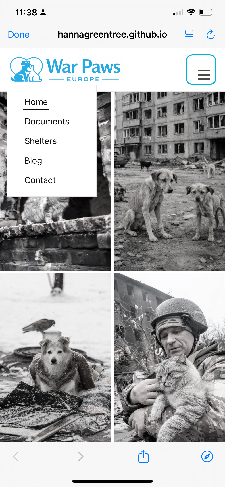
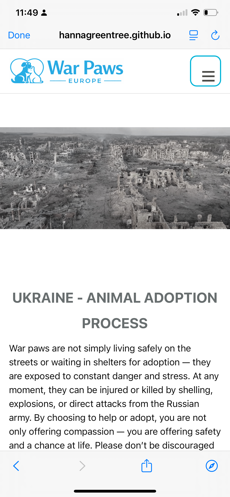
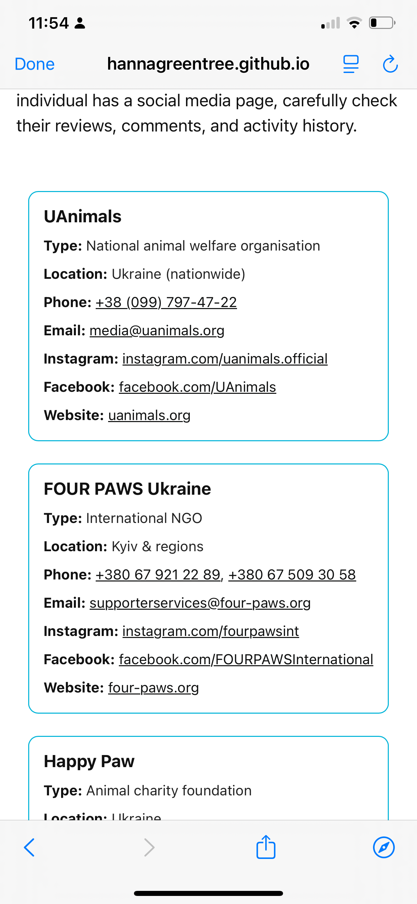
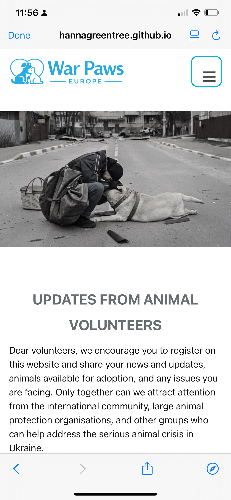

# War Paws Europe (WPE) — Full-Stack Django Web Application

War Paws Europe (WPE) is a volunteer-led full-stack platform that supports animals affected by the war in Ukraine by centralising adoption guidance, shelter/rescue contacts, and practical resources. The site also includes a **community-managed Blog dataset** where authorised volunteers/admins can publish updates that are immediately visible to the public.

**Live site (Render):** https://war-paws-europe-django.onrender.com
**Live site on Github (without Python):** https://hannagreentree.github.io/war-paws-europe/
**Live site on Github (with Python):**

---

## Value Provided (Why this project exists)

### 1) Community value (shared dataset)
WPE allows authorised community members (volunteers/admins) to **create and manage shared Blog posts** (a common dataset). Visitors benefit from convenient access to all published information in one place. The dataset becomes more valuable over time as more posts and updates are added.

### 2) Site owner value (goals advanced)
The site owner advances their goal of improving adoption clarity and reducing risk by providing a structured hub of guidance and a managed dataset of verified posts/resources. The owner may also contribute as a regular user, and benefits from the overall dataset growing into a reliable library.

---

## Objectives:
- Provide clear adoption and transport guidance (steps, documents, costs)
- Share structured lists of shelters, rescues, and volunteer contacts
- Reduce fraud risk by encouraging verification and transparency
- Publish updates via a Blog section
- Allow supporters, adopters, and shelters/volunteers to contact the project team

---

## Project Purpose and Rationale 

The purpose of WPE is immediately evident to new users: it provides **adoption guidance, resource lists, and safety reminders** to reduce confusion, improve safety, and help animals in crisis. The platform addresses multiple related audiences (adopters, Ukrainians fleeing with pets, shelters/rescues, animal protection organisations) by offering clear navigation and actionable information. This project is a reminder that war has not ended and animals require urgent help. 

---

## Target Audience
- People worldwide who want to adopt or support animals (including people in Ukraine)
- Ukrainians fleeing the war or travelling abroad with their pets
- Animal protection organisations raising awareness or coordinating help
- Shelters/rescues in other countries with capacity to accept animals
- Volunteers/shelters needing a reliable place to share updates and contacts

---

## Development Timeline / Actions Taken

- **Initial Planning** — page goals and content planning (Home, Documents, Shelters, Blog, Contact)
- **Setup** — Django project structure, templates, static files, routing, and deployment configuration
- **Design** — consistent layout, header/footer system, responsive sections, card-style content areas
- **Functionality**
  - JavaScript: menu toggle, year update, war-day counter, hero overlay reveal, scroll-triggered image swaps
  - Django: blog create/edit/delete flow for authorised users
  - Contact forms UI (and backend handling if implemented)
- **Content Integration** — real guidance text and shelter/resource lists
- **Testing & Validation** — HTML/CSS validation, JavaScript checks, Django manual testing of blog/admin features
- **Deployment** — Render deployment and verification

---

### Design Note (Wireframes)
I understand that creating wireframes and saving design references is an important part of the planning process because it helps document decisions and supports better development workflow. Unfortunately, I lost my original wireframes/design files for this project. To document the design properly, I will include clear screenshots of the final implemented pages (desktop + mobile) as evidence of layout, structure, and responsiveness.

## Screenshots (Replace Wireframes)

### Home Page (Desktop)

---

### Shelters Page (Desktop)

---

### Documents Page (Desktop)

---

### Blog Page (Desktop)

---

### Contact Page (Desktop)

### Home Page (Mobile)

---

### Documents Page (Mobile)

---

### Shelters Page (Mobile)

---

### Blog Page (Mobile)

---

### Contact Page (Mobile)

## Technologies Used
- **HTML, CSS, JavaScript**
- **Python + Django**
- **Relational Database** (recommended: **PostgreSQL** in production)
- Deployment: **Render**
- Additional libraries/APIs: documented in `requirements.txt` and in Credits

---

## Core Features (Front-End + Back-End)

### Front-End (HTML/CSS/JavaScript)
- Responsive navigation with a mobile hamburger toggle
- Home page hero overlay reveal animation
- Scroll-triggered image reveal using `IntersectionObserver`
- Live war-day counter (UTC-safe calculation) on Home
- Footer year display updated on page load
- Accessible patterns: semantic HTML, alt text, ARIA where needed

### Back-End (Python/Django)
- Django templates and routing
- Blog dataset stored in a relational database
- Authenticated management of Blog records:
   authorised users (admin/volunteer) can **Create / Read / Update / Delete** posts
- Django Admin support for managing content (where enabled)

---

## Pages / User Journey
- **Home** — mission, awareness content, hero visuals, war-day counter, FAQ preview
- **Documents** — adoption/transport steps, costs, services, labs/clinics, volunteers
- **Shelters** — shelters/private rescues list with contact links
- **Blog** — dataset of posts/news from local volynteers or shelters; authorised users manage records (CRUD)
- **Contact** — contact forms for different user scenarios depend on whether you are an adopter or a volunteer

---

## Database & Data Model 

### Domain dataset
The main managed dataset is **Blog posts** (records created by authorised users and shared with the community).

#### `Post`
- `id` (PK)
- `title` (text)
- `content` (long text)
- `created_at` (datetime)
- `updated_at` (datetime)
- `author` (FK → `User`)

#### `User` (Django auth)
- `id` (PK)
- `username`
- `email`
- `password_hash` (managed by Django)
- `is_staff` / `is_superuser` (for admin/volunteer management)

### Relationships 
- One **User** can create many **Posts** (one-to-many).
- Each **Post** belongs to exactly one **User** (author).

This structure fits the domain because the dataset requires ownership/traceability and controlled publishing.

---

## CRUD Functionality

Authorised users (admin/volunteer) can:
- **Create** a post (new record)
- **Read** posts (list and detail pages)
- **Update** a post (edit record)
- **Delete** a post (remove record)

**UI reflection:**
- After Create/Edit/Delete, the blog list/detail updates immediately (after redirect/refresh) to show the latest database state.

---

## UX, Accessibility & Feedback 

- Clear navigation across all pages
- Responsive layout for mobile/tablet/desktop
- User actions provide feedback:
  - CRUD actions redirect to updated blog list/detail
  - Form validation shows required fields
  - Mobile menu state changes using `aria-expanded`
- Accessibility:
  - alt text and decorative image handling
  - ARIA attributes for interactive elements (navigation/menu and any tab patterns used)

**ARIA explanation:**  
ARIA (Accessible Rich Internet Applications) attributes help screen readers understand interactive UI elements such as menus and tab-like controls.

---

## Front-End Implementation Details 

- Custom HTML and CSS are used throughout the site templates.
- Layout is structured with a consistent header/footer and page sections.
- JavaScript provides interactive behaviour and progressive enhancements.

---

## Back-End Implementation & Python Standards 

- Django views/logic query and manipulate database records.
- Python code follows readable naming, indentation, and commenting conventions.
- Code includes compound statements (`if` conditions and loops) (example: validation, filtering, permissions checks).
- Style: written to align with PEP8 standards.

---

## File Naming & Project Hygiene 

- Files are named descriptively, lowercase, and without spaces for cross-platform compatibility.
- Production code is free of commented-out code and broken internal links.
- The application run without errors across the site.

---

## Templates & Django Syntax 

- Django templates are used for consistent layout and reusable structures (e.g., base template with shared header/footer).
- Template syntax supports dynamic rendering of data (blog list/detail, authenticated UI).

---

## Testing & Validation 

### HTML Validation
W3C HTML Validator: https://validator.w3.org/nu/  
Actions taken:
- Fixed section/heading warnings
- Fixed heading hierarchy issues
- Improved ARIA correctness where required

### CSS Validation
W3C CSS Validator: https://jigsaw.w3.org/css-validator/

### JavaScript Validation
- ESLint syntax checks: https://eslint.org/demo
- Browser DevTools Console (manual checks)

### Django / Python Testing
 python manage.py check
 python manage.py test

### Manual Test Plan (document results) 
Create a TESTING.md (recommended) and include:
- Functionality tests (CRUD, nav, forms)
- Usability tests (clear user journey)
- Responsiveness tests (mobile/tablet/desktop)
- Data management tests (records persist, correct display, correct permissions)
- Bugs found + fixes applied + remaining known bugs

### Deployment (Render) 
Live site: https://war-paws-europe-django.onrender.com
### Deployment Procedure (Render)
#### 1. Push repository to GitHub.
#### 2. Create a new Render Web Service connected to the repo.
#### 3. Ensure these project files exist and are maintained:
- requirements.txt 
- settings.py 
- Procfile if required by your deployment approach 
#### 4. Set environment variables in Render:
- SECRET_KEY
- DEBUG=False 
- Database variables (e.g., DATABASE_URL)
#### 5. Build command (example):

pip install -r requirements.txt && python manage.py collectstatic --noinput && python manage.py migrate

#### 6. Start command:

gunicorn war_paws_europe.wsgi:application 

#### 7. Test the deployed version matches the development version:
- Pages load
- Static files load
- Blog CRUD works for authorised users

### Database Configuration 
Database configuration is kept in a single location (Django settings.py) and is easy to change per environment (local vs production). Production uses environment variables (e.g., DATABASE_URL) rather than hard-coded secrets.
### Security Features Considered 
- No secrets committed to the repository
- Secrets stored using environment variables and/or .env in .gitignore
- DEBUG turned off in production
#### Django security defaults:
- CSRF protection on forms
- password hashing
- template auto-escaping to reduce XSS risk
- authentication and authorisation for CRUD actions (login required)

### Version Control (Git & GitHub) 
- Git & GitHub used throughout development up to deployment
- Commits are small, clear, and feature-focused
- Commit messages document the development process and fixes
##### Honest note: Sometimes I was rushing and my commit messages were not as detailed as they should be. I understand the importance of clear commits and will improve this going forward.

### Credits & Attribution 
#### External references / tutorials / docs
* MDN: DOMContentLoaded — https://developer.mozilla.org/en-US/docs/Web/API/Document/DOMContentLoaded_event
* MDN: IntersectionObserver — https://developer.mozilla.org/en-US/docs/Web/API/Intersection_Observer_API
* W3C Validators — HTML/CSS validation tools
External snippets used in code should be credited with a comment above it in the file, but unfortunatly due to time limitation they are listed in this file
### Images
Some images were taken from social media accounts of Ukrainian shelters/rescuers. These images are used only for educational/student project purposes and should not be redistributed or reused commercially without permission from the original owners.

### Wireframes / Design Evidence
I understand that wireframes and saved design planning are important for documentation and learning. Unfortunately, I lost my original wireframes/design files for this project. To document design decisions and responsiveness, I will include screenshots of the final implemented pages (desktop + mobile).
* For that reason I created a folder: images/screenshots/

### Code Snippets 

#### Footer Year (JavaScript)

const yearEl = document.getElementById("year");
if (yearEl) yearEl.textContent = new Date().getFullYear();

### War Day Counter (UTC-safe)

const warDayEl = document.getElementById("warDayNumber");
if (warDayEl) {
  const warStartUTC = Date.UTC(2022, 1, 24);
  const now = new Date();
  const todayUTC = Date.UTC(now.getUTCFullYear(), now.getUTCMonth(), now.getUTCDate());
  const days = Math.floor((todayUTC - warStartUTC) / (24 * 60 * 60 * 1000));
  warDayEl.textContent = String(days);
}

### Honest Development Reflection
Throughout this project, I aimed to improve my development process compared to my previous work. While I did use Git regularly and provided more descriptive commit messages than in my earlier project, I acknowledge that some commits could have been more detailed. At times I was working under pressure or focused heavily on solving a technical issue, and I did not always document changes as clearly as I should have. I understand that clear, specific commit messages are essential for teamwork, maintainability, and professional collaboration, and this is an area I am consciously continuing to improve.
In some cases, I used external code references (such as documentation examples or tutorial-inspired snippets), but I did not always clearly mark them inside the individual HTML/JS files. I recognise that proper attribution is important both ethically and professionally, especially when working in teams or open-source environments. Going forward, I will ensure that all externally inspired code is clearly documented within the files as well as in the README.

I also understand the importance of creating and preserving wireframes before building a project. I originally had design planning materials for this project, but unfortunately I lost them. I am aware that maintaining design documentation is a key part of professional workflow and supports clearer development decisions. Although the original wireframes are no longer available, I have included screenshots of the final implementation to demonstrate layout, structure, and responsiveness.

Regarding AI usage: I frequently used ChatGPT as a learning support tool — similar to having a personal tutor, adviser, or mentor. I asked questions, checked logic, debugged issues, and clarified concepts. However, I was always mindful that AI should be used strictly as a learning aid, not as a replacement for understanding. I made sure to review, adapt, and understand any suggested solutions before implementing them. My goal in this course is to learn and develop real coding ability — if I did not understand how things worked, I would not be gaining the skills I am here to build.

This project reflects both my current skill level and my growth. I recognise areas for improvement (documentation precision, attribution clarity, wireframe preservation), and I am actively learning from these experiences to strengthen my professional development practices.

### Author
#### Hanna Greentree
Full-Stack Django Web Application third project

